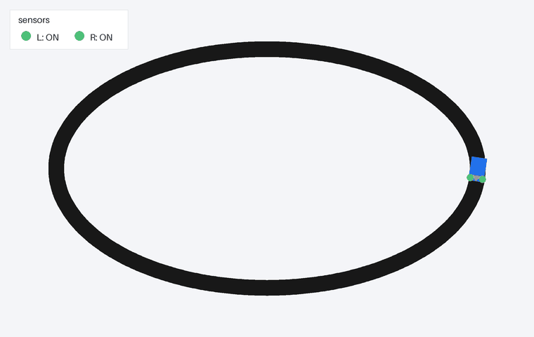
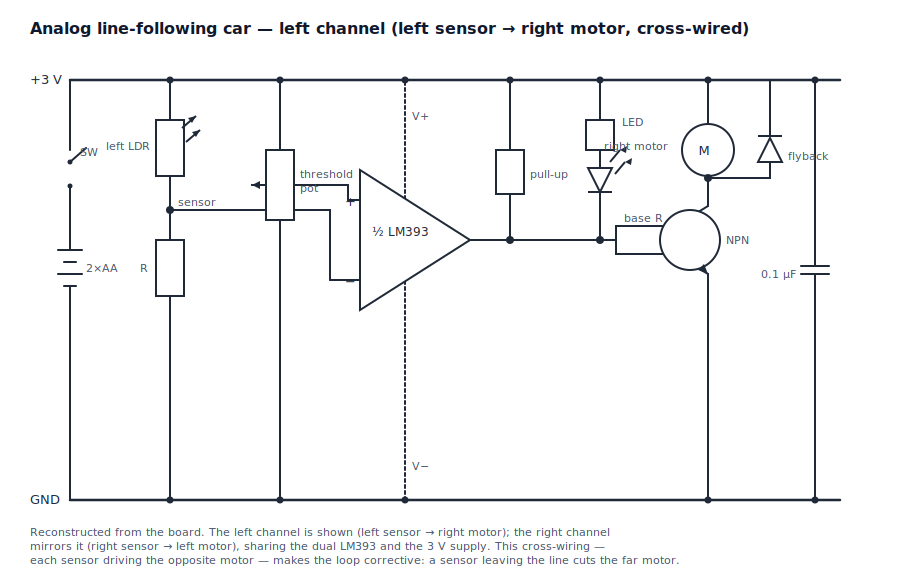
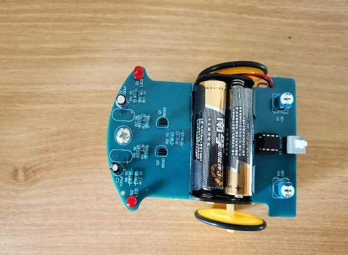
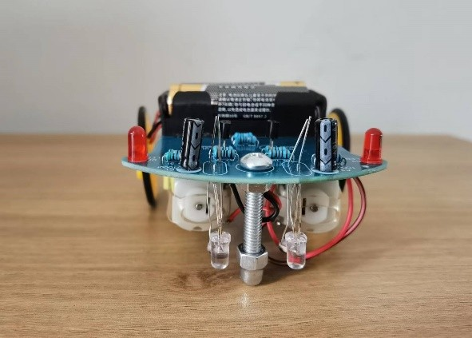
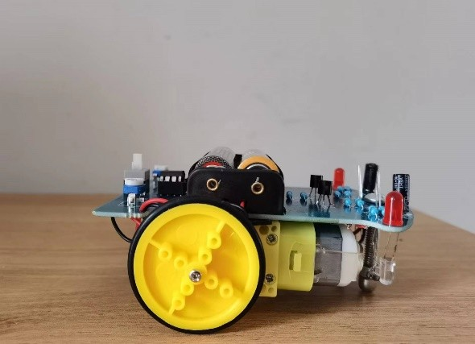
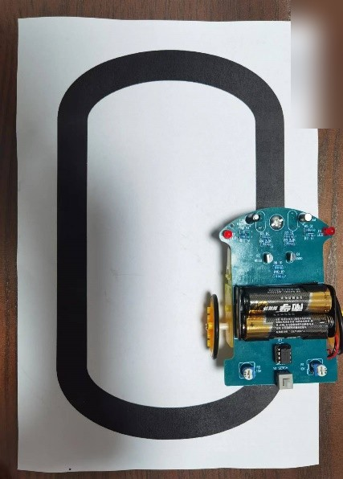

# 循迹小车（Line-Following Robot）

*[English](README.md) | 中文*

[](LICENSE)

一台会沿着地上黑线自己走的两轮小车。它用两个光敏传感器和一片模拟比较器来转向，车上没有
单片机，所以没有任何程序在车上跑。这套小车是我自己装好、调好的；另外我写了仓库里的这个
仿真，让你不用实物也能看到整个控制过程。



## 工作原理

车头朝下装着两个光敏电阻（LDR）。每个接到 LM393 比较器的一路，和一个用微调电位器设定的
阈值作比较，输出一个干净的开/关信号。两路是交叉接的，每个传感器控制对面那一侧的电机。小车
一旦偏了、某个传感器滑出线外，对侧的电机就减速，车子自己拐回来。这些都在模拟电路里发生，
不用写代码。

更详细的说明在 [docs/how-it-works.zh-CN.md](docs/how-it-works.zh-CN.md)，完整电路在
[hardware/schematic.svg](hardware/schematic.svg)。

## 仿真

小车的判断都在硬件里完成，为了能直观看到这个过程，我用软件把同样的思路重写了一遍。它是
对控制原理的软件建模，不是车上的固件——真实小车上根本没有固件。

模型用 C++ 写（在 `src/` 里）。两个传感器读一条画出来的线，一个简单的开/关规则决定两个
轮子的速度，再用一个基础的差速模型把车开起来。仿真程序把每条赛道跑一遍，写出一份轨迹日志
（每帧一行：位置、朝向，以及两个传感器的状态）。再用一个 Python 脚本（`render.py`，基于
Pillow 和 numpy）读这份日志，把赛道和小车重新画出来，存成上面那张动图。一共有三条赛道可选：
椭圆、波浪，还有一条自己交叉的 8 字。

有一个行为只在仿真里有：小车要是在急弯上丢了线，会按上一次的方向继续拐，直到重新找到线。
真实的板子没有记忆，做不到这一点。

## 浏览器演示

仓库里还有一个跑在浏览器里的轻量播放器，在 [`web/`](web/) 下。它**只做动画**：C++ 引擎把每条
赛道跑一遍，把轨迹导出成 JSON（`web/data/oval.json`、`wavy.json`、`figure8.json`），播放器只是
把这份数据读进来，在画布上逐帧画出来。这个页面**不**在 JavaScript 里重新跑仿真——播放器里没有
传感器模型、没有比较器、没有控制器、也没有运动学。它读的是预先算好的小车位姿和两个预先算好的
传感器状态，然后画出来，并配上赛道选择、播放/暂停、速度滑块和一个实时的左/右传感器读数面板。

数据文件直接来自引擎：

```bash
make web      # 用 C++ 仿真程序写出 web/data/{oval,wavy,figure8}.json
```

然后打开 `web/index.html`（或仓库根目录的 `index.html`，它会跳转过去）。播放器动画用的这份 JSON，
和喂给 GIF 的那一份出自同一个仿真步骤，所以两者总是一致。

### 构建与运行

需要一个 C++17 编译器，以及装了 Pillow 和 numpy 的 Python。用 `make`：

```bash
make test     # 构建并运行无界面测试
make web      # 为浏览器播放器导出 web/data/*.json
make gif      # 重新生成 media/demo.gif 和 media/demo-figure8.gif
```

或者手动：

```bash
c++ -O2 -std=c++17 tests/test.cpp -o build/test && ./build/test
c++ -O2 -std=c++17 src/line_follower.cpp -o build/line_follower
./build/line_follower oval 1400 build/traj-oval.csv     # 给 GIF 渲染用的 CSV
./build/line_follower oval 1400 web/data/oval.json      # 给浏览器播放器用的 JSON
python3 render.py build/traj-oval.csv media/demo.gif
```

输出路径以 `.json` 结尾时，仿真程序写出播放器要的 JSON（赛道折线加每帧轨迹）；其它路径则写出
Python 渲染脚本读的 CSV。两者都出自同一个仿真步骤。

测试跑的是同一套控制和运动代码，只是没有界面。它检查小车在三条赛道上都贴着线、偏差只有
几个像素，并且把转向方向用世界坐标固定下来——这样一来，把模型镜像翻转的版本会让测试失败。

## 硬件



图里画的是其中一路。另一路是一样的，由右边传感器带左边电机；两路共用同一片 LM393 和 3 V
电源。元件清单在 [hardware/bom.md](hardware/bom.md)。

| | |
|---|---|
|  |  |
|  |  |

## 装配

装配和调试的步骤在 [docs/build-guide.zh-CN.md](docs/build-guide.zh-CN.md)。

## 目录结构

```
src/        C++ 仿真核心（line_follower.h, line_follower.cpp）
tests/      无界面 C++ 测试
render.py   画动图的 Python（Pillow）渲染脚本
web/        浏览器播放器（index.html, player.js, style.css）以及 data/*.json
index.html  跳转到 web/，给静态站点用
Makefile    构建 + 测试 + 数据 + web + 渲染目标
hardware/   电路图和元件清单
docs/       工作原理、装配指南
media/      照片和演示动图
```

## 许可

MIT，见 [LICENSE](LICENSE)。作者 Jiayi Mu（[github.com/jiayimu007](https://github.com/jiayimu007)）。
